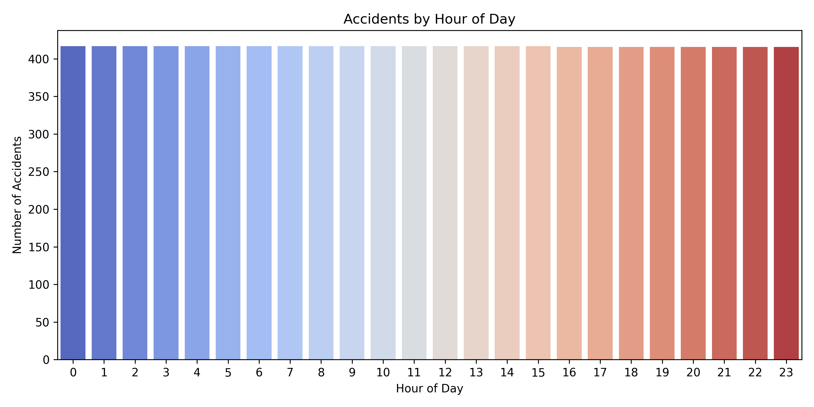

# 🚗 PRODIGY_DS_05 – US Traffic Accident Analysis

This repository contains my submission for **Task 5** of the **PRODIGY Data Science Internship**.

## 📌 Objective
Analyze and visualize patterns in US traffic accident data related to:
- Road conditions
- Weather
- Time of day
- Accident-prone cities

## 🧾 Dataset
- Source: [US Accidents - Kaggle](https://www.kaggle.com/datasets/sobhanmoosavi/us-accidents)
- Sample size used: 10,000+ rows for performance

## 📊 Visualizations Included
- Accidents by Hour of Day
- Top Weather Conditions during Accidents
- Cities with Most Accidents
- Correlation Heatmap of Numerical Features

## 🧰 Tools Used
- Python
- Pandas
- Seaborn
- Matplotlib

## ✅ Sample Output

## 📌 Outcome
This analysis highlights when and where accidents are most likely, and how weather contributes to accident patterns.
